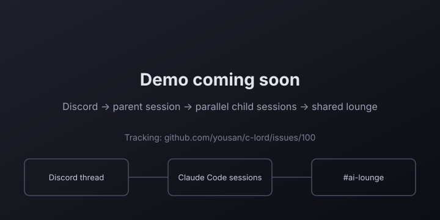

# c-lord

[](https://github.com/yousan/c-lord/actions/workflows/ci.yml)
[](https://www.python.org/downloads/)
[](https://opensource.org/licenses/MIT)

**Run multiple Claude Code sessions in parallel from Discord — each in its own git worktree, coordinating through a shared lounge so they never clobber each other.**

<!-- TODO(#100): replace this placeholder with a ~30s demo GIF showing parent → parallel child sessions → shared lounge → consolidated reply. -->
<p align="center">
  <a href="https://github.com/yousan/c-lord/issues/100">
    
  </a>
</p>

Each Discord thread becomes a fully isolated Claude Code session. Work on a feature in one thread, review a PR in another, and run a background task in a third — simultaneously, from your phone, tablet, or desktop. The bridge handles all the coordination so sessions never clobber each other.

**[日本語](docs/ja/README.md)** | **[简体中文](docs/zh-CN/README.md)** | **[한국어](docs/ko/README.md)** | **[Español](docs/es/README.md)** | **[Português](docs/pt-BR/README.md)** | **[Français](docs/fr/README.md)**

> **Based on [claude-code-discord-bridge](https://github.com/ebibibi/claude-code-discord-bridge) by [@ebibibi](https://github.com/ebibibi) (Masahiko Ebisuda).** This project was originally created by ebibibi and is used here under the MIT License. Thank you for the great foundation.

> **Disclaimer:** This project is not affiliated with, endorsed by, or officially connected to Anthropic. "Claude" and "Claude Code" are trademarks of Anthropic, PBC. This is an independent open-source tool that interfaces with the Claude Code CLI.

> **Built entirely by Claude Code.** This entire codebase — architecture, implementation, tests, documentation — was written by Claude Code itself. The human author provided requirements and direction via natural language. See [How This Project Was Built](#how-this-project-was-built).

---

## The Big Idea: Parallel Sessions Without Fear

When you send tasks to Claude Code in separate Discord threads, the bridge does four things automatically:

1. **Concurrency notice injection** — Every session's system prompt includes mandatory instructions: create a git worktree, work only inside it, never touch the main working directory directly.

2. **Active session registry** — Each running session knows about the others. If two sessions are about to touch the same repo, they can coordinate rather than conflict.

3. **Coordination channel** — A shared Discord channel where sessions broadcast start/end events. Both Claude and humans can see at a glance what's happening across all active threads.

4. **AI Lounge** — A session-to-session "breakroom" injected into every prompt. Before starting, each session reads recent lounge messages to see what other sessions are doing. Before disruptive operations (force push, bot restart, DB drop), sessions check the lounge first so they don't stomp on each other's work.

```
Thread A (feature)   ──→  Claude Code (worktree-A)  ─┐
Thread B (PR review) ──→  Claude Code (worktree-B)   ├─→  #ai-lounge
Thread C (docs)      ──→  Claude Code (worktree-C)  ─┘    "A: auth refactor in progress"
           ↓ lifecycle events                              "B: PR #42 review done"
   #coordination channel                                   "C: updating README"
   "A: started on auth refactor"
   "B: reviewing PR #42"
   "C: updating README"
```

No race conditions. No lost work. No merge surprises.

---

## What You Can Do

### Interactive Chat (Mobile / Desktop)

Use Claude Code from anywhere Discord runs — phone, tablet, or desktop. Each message creates or continues a thread, mapping 1:1 to a persistent Claude Code session.

### Parallel Development

Open multiple threads simultaneously. Each is an independent Claude Code session with its own context, working directory, and git worktree. Useful patterns:

- **Feature + review in parallel**: Start a feature in one thread while Claude reviews a PR in another.
- **Multiple contributors**: Different team members each get their own thread; sessions stay aware of each other via the coordination channel.
- **Experiment safely**: Try an approach in thread A while keeping thread B on stable code.

### Scheduled Tasks (SchedulerCog)

Register periodic Claude Code tasks from a Discord conversation or via REST API — no code changes, no redeploys. Tasks are stored in SQLite and run on a configurable schedule. Claude can self-register tasks during a session using `POST /api/tasks`.

```
/skill name:goodmorning         → runs immediately
Claude calls POST /api/tasks    → registers a periodic task
SchedulerCog (30s master loop)  → fires due tasks automatically
```

### CI/CD Automation

Trigger Claude Code tasks from GitHub Actions via Discord webhooks. Claude runs autonomously — reads code, updates docs, creates PRs, enables auto-merge.

```
GitHub Actions → Discord Webhook → Bridge → Claude Code CLI
                                                  ↓
GitHub PR ←── git push ←── Claude Code ──────────┘
```

**Real example:** On every push to `main`, Claude analyzes the diff, updates English + Japanese documentation, creates a bilingual PR, and enables auto-merge. Zero human interaction.

### AI Lounge

A shared "breakroom" channel where all concurrent sessions announce themselves, read each other's updates, and coordinate before disruptive operations.

Each Claude session receives the lounge context automatically via `--append-system-prompt` — injected as ephemeral system context rather than as part of the conversation history. This prevents the context from accumulating across turns, which would otherwise cause "Prompt is too long" errors in long-running sessions. The injected context includes: recent messages from other sessions, plus the rule to check before doing anything destructive.

```bash
# Sessions post their intentions before starting:
curl -X POST "$CLORD_API_URL/api/lounge" \
  -H "Content-Type: application/json" \
  -d '{"message": "Starting auth refactor on feature/oauth — worktree-A", "label": "feature dev"}'

# Read recent lounge messages (also injected into each session automatically):
curl "$CLORD_API_URL/api/lounge"
```

The lounge channel doubles as a human-visible activity feed — open it in Discord to see at a glance what every active Claude session is currently doing.

### Programmatic Session Creation

Spawn new Claude Code sessions from scripts, GitHub Actions, or other Claude sessions — without Discord message interaction.

```bash
# From another Claude session or a CI script:
curl -X POST "$CLORD_API_URL/api/spawn" \
  -H "Content-Type: application/json" \
  -d '{"prompt": "Run security scan on the repo", "thread_name": "Security Scan"}'
# Returns immediately with the thread ID; Claude runs in the background
```

Claude subprocesses receive `DISCORD_THREAD_ID` as an environment variable, so a running session can spawn child sessions to parallelize work.

### Startup Resume

If the bot restarts mid-session, interrupted Claude sessions are automatically resumed when the bot comes back online. Sessions are marked for resume in three ways:

- **Automatic (upgrade restart)** — `AutoUpgradeCog` snapshots all active sessions just before a package upgrade restart and marks them automatically.
- **Automatic (any shutdown)** — `ClaudeChatCog.cog_unload()` marks all mid-run sessions whenever the bot shuts down via any mechanism (`systemctl stop`, `bot.close()`, SIGTERM, etc.).
- **Manual** — Any session can call `POST /api/mark-resume` directly.

---

## Features

### Interactive Chat

#### 🔗 Session Basics
- **Thread = Session** — 1:1 mapping between Discord thread and Claude Code session
- **Session persistence** — Resume conversations across messages via `--resume`
- **Concurrent sessions** — Multiple parallel sessions with configurable limit
- **Stop without clearing** — `/stop` halts a session while preserving it for resume
- **Session interrupt** — Sending a new message to an active thread sends SIGINT to the running session and starts fresh with the new instruction; no manual `/stop` needed

#### 📡 Real-time Feedback
- **Real-time status** — Emoji reactions: 🧠 thinking, 🛠️ reading files, 💻 editing, 🌐 web search
- **Streaming text** — Intermediate assistant text appears as Claude works
- **Tool result embeds** — Live tool call results with elapsed time ticking up every 10s
- **Extended thinking** — Reasoning shown as spoiler-tagged embeds (click to reveal)
- **Thread dashboard** — Live pinned embed showing which threads are active vs. waiting; owner @-mentioned when input is needed

#### 🤝 Human-in-the-Loop
- **Interactive questions** — `AskUserQuestion` renders as Discord Buttons or Select Menu; session resumes with your answer; buttons survive bot restarts
- **Plan Mode** — When Claude calls `ExitPlanMode`, a Discord embed shows the full plan with Approve/Cancel buttons; Claude proceeds only after approval; auto-cancel on 5-minute timeout
- **Tool permission requests** — When Claude needs permission to execute a tool, Discord shows Allow/Deny buttons with the tool name and input; auto-deny after 2 minutes
- **MCP Elicitation** — MCP servers can request user input via Discord (form-mode: up to 5 Modal fields from JSON schema; url-mode: URL button + Done confirmation); 5-minute timeout
- **Live TodoWrite progress** — When Claude calls `TodoWrite`, a single Discord embed is posted and edited in-place on each update; shows ✅ completed, 🔄 active (with `activeForm` label), ⬜ pending items

#### 📊 Observability
- **Token usage** — Cache hit rate and token counts shown in session-complete embed
- **Context usage** — Context window percentage (input + cache tokens, excluding output) and remaining capacity until auto-compact shown in session-complete embed; ⚠️ warning when above 83.5%
- **Compact detection** — Notifies in-thread when context compaction occurs (trigger type + token count before compact)
- **Hard stall notification** — Thread message after 30 s of no activity (extended thinking or context compression); resets automatically when Claude resumes
- **Timeout notifications** — Embed with elapsed time and resume guidance on timeout

#### 🔌 Input & Skills
- **Attachment support** — Text files auto-appended to prompt (up to 5 × 50 KB); images downloaded and passed via `--image` (up to 4 × 5 MB)
- **Skill execution** — `/skill` command with autocomplete, optional args, in-thread resume
- **Hot reload** — New skills added to `~/.claude/skills/` are picked up automatically (60s refresh, no restart)

### Concurrency & Coordination
- **Worktree instructions auto-injected** — Every session prompted to use `git worktree` before touching any file
- **Automatic worktree cleanup** — Session worktrees (`wt-{thread_id}`) are removed automatically at session end and on bot startup; dirty worktrees are never auto-removed (safety invariant)
- **Active session registry** — In-memory registry; each session sees what the others are doing
- **AI Lounge** — Shared "breakroom" channel; context injected via `--append-system-prompt` (ephemeral, never accumulates in history) so long sessions never hit "Prompt is too long"; sessions post intentions, read each other's status, and check before disruptive operations; humans see it as a live activity feed
- **Coordination channel** — Optional shared channel for cross-session lifecycle broadcasts
- **Coordination scripts** — Claude can call `coord_post.py` / `coord_read.py` from within a session to post and read events

### Scheduled Tasks
- **SchedulerCog** — SQLite-backed periodic task executor with a 30-second master loop
- **Self-registration** — Claude registers tasks via `POST /api/tasks` during a chat session
- **No code changes** — Add, remove, or modify tasks at runtime
- **Enable/disable** — Pause tasks without deleting them (`PATCH /api/tasks/{id}`)

### CI/CD Automation
- **Webhook triggers** — Trigger Claude Code tasks from GitHub Actions or any CI/CD system
- **Auto-upgrade** — Automatically update the bot when upstream packages are released
- **DrainAware restart** — Waits for active sessions to finish before restarting
- **Auto-resume marking** — Active sessions are automatically marked for resume on any shutdown (upgrade restart via `AutoUpgradeCog`, or any other shutdown via `ClaudeChatCog.cog_unload()`); they pick up where they left off after the bot comes back online
- **Restart approval** — Optional gate to confirm upgrades; approve via ✅ reaction in the upgrade thread or via button posted to the parent channel
- **Manual upgrade trigger** — `/upgrade` slash command lets authorised users trigger the upgrade pipeline directly from Discord (opt-in via `slash_command_enabled=True`)

### Session Management
- **Session list** — `/sessions` lists all known sessions
- **Resume info** — `/resume-info` shows the CLI command to continue the current session in a terminal
- **Startup resume** — Interrupted sessions restart automatically after any bot reboot; `AutoUpgradeCog` (upgrade restarts) and `ClaudeChatCog.cog_unload()` (all other shutdowns) mark them automatically, or use `POST /api/mark-resume` manually
- **Programmatic spawn** — `POST /api/spawn` creates a new Discord thread + Claude session from any script or Claude subprocess; returns non-blocking 201 immediately after thread creation
- **Thread ID injection** — `DISCORD_THREAD_ID` env var is passed to every Claude subprocess, enabling sessions to spawn child sessions via `$CLORD_API_URL/api/spawn`
- **Worktree management** — `/worktree-list` shows all active session worktrees with clean/dirty status; `/worktree-cleanup` removes orphaned clean worktrees (supports `dry_run` preview)
- **Runtime model switching** — `/model-show` displays the current global model and per-thread session model; `/model-set` changes the model for all new sessions without restart

### Security
- **No shell injection** — `asyncio.create_subprocess_exec` only, never `shell=True`
- **Session ID validation** — Strict regex before passing to `--resume`
- **Flag injection prevention** — `--` separator before all prompts
- **Secret isolation** — Bot token stripped from subprocess environment
- **User authorization** — `allowed_user_ids` restricts who can invoke Claude

---

## Quick Start — Claude in Discord in 5 Minutes

### Step 1 — Create a Discord Bot (one-time, ~2 minutes)

1. Go to [discord.com/developers/applications](https://discord.com/developers/applications) → **New Application**
2. Navigate to **Bot** → enable **Message Content Intent** under Privileged Gateway Intents
3. Copy the bot **Token**
4. Go to **OAuth2 → URL Generator**: Scopes `bot` + `applications.commands`, Permissions: Send Messages, Create Public Threads, Send Messages in Threads, Add Reactions, Manage Messages, Read Message History
5. Open the generated URL → invite the bot to your server

### Step 2 — Run the Setup Wizard

No cloning or `.env` editing required — the wizard does it for you:

```bash
# With uvx (no install needed):
uvx --from "git+https://github.com/yousan/c-lord.git" c-lord setup

# Or after cloning:
git clone https://github.com/yousan/c-lord.git
cd c-lord
uv run c-lord setup
```

The wizard will:
1. Validate your bot token against the Discord API
2. **Automatically list available channels** — just pick a number (no ID copying)
3. Ask for your working directory and model preference
4. Write `.env` and offer to start the bot immediately

```
╔══════════════════════════════════════════════════════╗
║          c-lord setup — interactive wizard             ║
╚══════════════════════════════════════════════════════╝

Step 1 — Claude Code CLI
  ✅  claude found

Step 2 — Discord Bot Token
  Bot Token: [paste here]
  Validating token… ✅  Logged in as MyBot#1234

Step 3 — Discord Channel ID
  Fetching channels via Discord API… ✅  Found 5 text channel(s)

   1. #general        (My Server)
   2. #claude-code    (My Server)
   3. #dev            (My Server)
   ...

  Select channel [1-5]: 2
  ✅  #claude-code (123456789012345678)

  ...

  ✅  Written: .env
  Start the bot now? [Y/n]: y
```

### Start / Stop

```bash
c-lord start    # start the bot (reads .env in current dir)
c-lord start --env /path/to/.env   # custom .env location
```

Send a message in the configured channel — Claude will reply in a new thread.

---

### Minimal Bot (Install as a Package)

If you already have a discord.py bot, add c-lord as a package instead:

```bash
uv add git+https://github.com/yousan/c-lord.git
```

Create a `bot.py`:

```python
import asyncio
import os
from dotenv import load_dotenv
import discord
from discord.ext import commands
from c_lord import ClaudeRunner, setup_bridge

load_dotenv()

intents = discord.Intents.default()
intents.message_content = True

bot = commands.Bot(command_prefix="!", intents=intents)
runner = ClaudeRunner(
    command="claude",
    model="sonnet",
    working_dir="/path/to/your/project",
)

@bot.event
async def on_ready():
    print(f"Logged in as {bot.user}")
    await setup_bridge(
        bot,
        runner,
        claude_channel_id=int(os.environ["DISCORD_CHANNEL_ID"]),
        allowed_user_ids={int(os.environ["DISCORD_OWNER_ID"])},
    )

asyncio.run(bot.start(os.environ["DISCORD_BOT_TOKEN"]))
```

`setup_bridge()` wires all Cogs automatically. Update to the latest version:

```bash
uv lock --upgrade-package c-lord && uv sync
```

---

## Configuration

| Variable | Description | Default |
|----------|-------------|---------|
| `DISCORD_BOT_TOKEN` | Your Discord bot token | (required) |
| `DISCORD_CHANNEL_ID` | Channel ID for Claude chat | (required) |
| `CLAUDE_COMMAND` | Path to Claude Code CLI | `claude` |
| `CLAUDE_MODEL` | Model to use | `sonnet` |
| `CLAUDE_PERMISSION_MODE` | Permission mode for CLI | `acceptEdits` |
| `CLAUDE_WORKING_DIR` | Working directory for Claude | current dir |
| `MAX_CONCURRENT_SESSIONS` | Max parallel sessions | `3` |
| `SESSION_TIMEOUT_SECONDS` | Session inactivity timeout | `300` |
| `DISCORD_OWNER_ID` | User ID to @-mention when Claude needs input | (optional) |
| `COORDINATION_CHANNEL_ID` | Channel ID for cross-session event broadcasts | (optional) |
| `CLORD_COORDINATION_CHANNEL_NAME` | Auto-create coordination channel by name | (optional) |
| `WORKTREE_BASE_DIR` | Base directory to scan for session worktrees (enables automatic cleanup) | (optional) |
| `CLORD_BRIDGE_MODE` | Set to `jsonl` to enable TranscriptMirror (tails Claude Code JSONL transcripts and forwards events to Discord threads) | (optional) |
| `CLORD_RENDER_TABLE_IMAGES` | Set to `1`, `true`, or `yes` to render GFM pipe tables as PNG images attached to Discord messages | (optional) |

### Table Image Rendering (CLORD_RENDER_TABLE_IMAGES)

When enabled, Markdown pipe tables in Claude's responses are rendered as PNG images using [Pillow](https://python-pillow.github.io/) and attached to the Discord message alongside the text. Each cell is split into text and emoji runs: **text is drawn with a CJK-capable font and emoji are drawn in full color** from a color emoji font, so 🟢/🔴 status lamps keep their color.

**Installation:**

```bash
uv add "c-lord[table]"
# or: pip install "c-lord[table]"
```

**Font support (CJK text + color emoji):**

c-lord renders text and emoji separately, picking the first font found in each group:

| Font file path | Group / Notes |
|---|---|
| `~/.local/share/fonts/NotoSansJP.ttf` | **Text** — recommended for Japanese |
| `/usr/share/fonts/opentype/noto/NotoSansCJK-Regular.ttc` | Text — covers JP / ZH / KO |
| `/usr/share/fonts/truetype/dejavu/DejaVuSans.ttf` | Text — last-resort (Latin only) |
| `~/.local/share/fonts/NotoColorEmoji.ttf` | **Color emoji** — 🟢🔴🟡✅⚠️ render in full color |
| `/usr/share/fonts/truetype/noto/NotoColorEmoji.ttf` | Color emoji — alternative system path |
| `~/.local/share/fonts/NotoEmoji-Regular.ttf` | Monochrome emoji — fallback if no color font (no color, but no tofu) |

If no color emoji font is present, c-lord falls back to a monochrome emoji font (glyph shapes, no color), then to drawing the raw character. Use the **CBDT** Noto Color Emoji — Pillow renders it with `embedded_color=True`.

**Quick install for Japanese + color emoji (Linux):**
```bash
mkdir -p ~/.local/share/fonts
# Japanese text
curl -Lo ~/.local/share/fonts/NotoSansJP.ttf \
  https://github.com/notofonts/noto-cjk/raw/main/Sans/OTF/Japanese/NotoSansCJK-Regular.ttc
# Color emoji (CBDT)
curl -Lo ~/.local/share/fonts/NotoColorEmoji.ttf \
  https://github.com/googlefonts/noto-emoji/raw/main/fonts/NotoColorEmoji.ttf
fc-cache -fv
```

Long cells are wrapped to a bounded width (`MAX_COL_WIDTH`, display-width aware so CJK counts double) so wide tables stay readable on mobile.

> **Note for other CJK languages (Chinese, Korean, Arabic, Thai, etc.):** install a font that covers the target script (e.g. Noto Sans SC for Simplified Chinese, Noto Sans KR for Korean) and add its path to the `_JP_FONT_PATHS` list in `c_lord/discord_ui/table_renderer.py`. Contributions adding multi-language font detection are welcome.

---

## Discord Bot Setup

1. Create a new application at [Discord Developer Portal](https://discord.com/developers/applications)
2. Create a bot and copy the token
3. Enable **Message Content Intent** under Privileged Gateway Intents
4. Invite the bot with these permissions:
   - Send Messages
   - Create Public Threads
   - Send Messages in Threads
   - Add Reactions
   - Manage Messages (for reaction cleanup)
   - Read Message History

---

## GitHub + Claude Code Automation

### Example: Automated Documentation Sync (implement in your own bot)

> **Note:** This is a pattern you can implement in your own bot — c-lord does not bundle documentation-sync workflows. For a reference implementation, see [EbiBot](https://github.com/ebibibi/discord-bot).

On every push to `main`, your bot can trigger Claude Code to:
1. Pull the latest changes and analyze the diff
2. Update English documentation
3. Translate to Japanese (or any target languages)
4. Create a PR with a bilingual summary
5. Enable auto-merge — merges automatically when CI passes

**GitHub Actions (add to your repo):**

```yaml
name: Documentation Sync
on:
  push:
    branches: [main]
jobs:
  trigger:
    if: "!contains(github.event.head_commit.message, '[docs-sync]')"
    runs-on: ubuntu-latest
    steps:
      - run: |
          curl -X POST "${{ secrets.DISCORD_WEBHOOK_URL }}" \
            -H "Content-Type: application/json" \
            -d '{"content": "🔄 docs-sync"}'
```

**Bot configuration:**

```python
from c_lord import WebhookTriggerCog, WebhookTrigger, ClaudeRunner

runner = ClaudeRunner(command="claude", model="sonnet")

triggers = {
    "🔄 docs-sync": WebhookTrigger(
        prompt="Analyze changes, update docs, create a PR with bilingual summary, enable auto-merge.",
        working_dir="/home/user/my-project",
        timeout=600,
    ),
}

await bot.add_cog(WebhookTriggerCog(
    bot=bot,
    runner=runner,
    triggers=triggers,
    channel_ids={YOUR_CHANNEL_ID},
))
```

**Security:** Prompts are defined server-side. Webhooks only select which trigger to fire — no arbitrary prompt injection.

### Example: Auto-Approve Owner PRs

```yaml
# .github/workflows/auto-approve.yml
name: Auto Approve Owner PRs
on:
  pull_request:
    types: [opened, synchronize, reopened]
jobs:
  auto-approve:
    if: github.event.pull_request.user.login == 'your-username'
    runs-on: ubuntu-latest
    permissions:
      pull-requests: write
      contents: write
    steps:
      - env:
          GH_TOKEN: ${{ secrets.GITHUB_TOKEN }}
          PR_NUMBER: ${{ github.event.pull_request.number }}
        run: |
          gh pr review "$PR_NUMBER" --repo "$GITHUB_REPOSITORY" --approve
          gh pr merge "$PR_NUMBER" --repo "$GITHUB_REPOSITORY" --auto --squash
```

---

## Scheduled Tasks

Register periodic Claude Code tasks at runtime — no code changes, no redeploys.

From within a Discord session, Claude can register a task:

```bash
# Claude calls this inside a session:
curl -X POST "$CLORD_API_URL/api/tasks" \
  -H "Content-Type: application/json" \
  -d '{"prompt": "Check for outdated deps and open an issue if found", "interval_seconds": 604800}'
```

Or register from your own scripts:

```bash
curl -X POST http://localhost:8080/api/tasks \
  -H "Authorization: Bearer your-secret" \
  -H "Content-Type: application/json" \
  -d '{"prompt": "Weekly security scan", "interval_seconds": 604800}'
```

The 30-second master loop picks up due tasks and spawns Claude Code sessions automatically.

---

## Auto-Upgrade

Automatically upgrade the bot when a new release is published:

```python
from c_lord import AutoUpgradeCog, UpgradeConfig

config = UpgradeConfig(
    package_name="c-lord",
    trigger_prefix="🔄 bot-upgrade",
    working_dir="/home/user/my-bot",
    restart_command=["sudo", "systemctl", "restart", "my-bot.service"],
    restart_approval=True,       # React ✅ in thread, or click button in channel
    slash_command_enabled=True,  # Enable /upgrade slash command (opt-in, default False)
)

await bot.add_cog(AutoUpgradeCog(bot, config))
```

#### Manual Trigger via `/upgrade`

When `slash_command_enabled=True`, any authorised user can run `/upgrade` directly in Discord to trigger the same upgrade pipeline — no webhook required. The command works from both text channels and threads (running it inside a thread creates the upgrade thread in the parent channel). It respects `upgrade_approval` and `restart_approval` gates, creates a progress thread, and gracefully handles concurrent runs (replies ephemerally if an upgrade is already in progress).

Before restarting, `AutoUpgradeCog`:

1. **Snapshots active sessions** — Collects all threads with running Claude sessions (duck-typed: any Cog with `_active_runners` dict is discovered automatically).
2. **Drains** — Waits for active sessions to finish naturally.
3. **Marks for resume** — Saves active thread IDs to the pending-resumes table. On next startup, those sessions are resumed automatically with a "bot restarted, please continue" prompt.
4. **Restarts** — Executes the configured restart command.

Any Cog with an `active_count` property is auto-discovered and drained:

```python
class MyCog(commands.Cog):
    @property
    def active_count(self) -> int:
        return len(self._running_tasks)
```

Session marking is fully opt-in — it only activates when `setup_bridge()` has initialized the session database (the default). When enabled, sessions resume with `--resume` continuity so Claude Code can pick up the exact conversation where it left off.

> **Coverage:** `AutoUpgradeCog` covers upgrade-triggered restarts. For *all other* shutdowns (`systemctl stop`, `bot.close()`, SIGTERM), `ClaudeChatCog.cog_unload()` provides a second automatic safety net.

---

## REST API

Optional REST API for notifications and task management. Requires aiohttp:

```bash
uv add "c-lord[api]"
```

### Endpoints

| Method | Path | Description |
|--------|------|-------------|
| GET | `/api/health` | Health check |
| POST | `/api/notify` | Send immediate notification |
| POST | `/api/schedule` | Schedule a notification |
| GET | `/api/scheduled` | List pending notifications |
| DELETE | `/api/scheduled/{id}` | Cancel a notification |
| POST | `/api/tasks` | Register a scheduled Claude Code task |
| GET | `/api/tasks` | List registered tasks |
| DELETE | `/api/tasks/{id}` | Remove a task |
| PATCH | `/api/tasks/{id}` | Update a task (enable/disable, change schedule) |
| POST | `/api/spawn` | Create a new Discord thread and start a Claude Code session (non-blocking) |
| POST | `/api/mark-resume` | Mark a thread for automatic resume on next bot startup |
| GET | `/api/lounge` | Read recent AI Lounge messages |
| POST | `/api/lounge` | Post a message to the AI Lounge (with optional `label`) |

```bash
# Send notification
curl -X POST http://localhost:8080/api/notify \
  -H "Authorization: Bearer your-secret" \
  -H "Content-Type: application/json" \
  -d '{"message": "Build succeeded!", "title": "CI/CD"}'

# Register a recurring task
curl -X POST http://localhost:8080/api/tasks \
  -H "Authorization: Bearer your-secret" \
  -H "Content-Type: application/json" \
  -d '{"prompt": "Daily standup summary", "interval_seconds": 86400}'
```

---

## Architecture

### How Discord maps to tmux

The "Discord thread = Claude Code session" idea sits on top of a tmux layout. Knowing this 1:1 mapping makes debugging and integration much easier (you can `tmux attach` to watch a session live):

| Discord | tmux         | Mapping |
|---------|--------------|---------|
| Channel | tmux session | 1:1     |
| Thread  | tmux window  | 1:1     |

- **1 Discord channel = 1 tmux session.** All threads in a channel share that one session. The session name is derived from the channel's bound repo (via `/clord-init`); unbound channels fall back to the default `clord` session.
- **1 thread = 1 tmux window = 1 Claude Code session.** Each thread gets its own window (`work1`, `work2`, …) running one Claude Code session. So your back-and-forth in a thread *is* the back-and-forth with that Claude session — replies continue it via `--resume`.

For the "why" behind this design, see [docs/PHILOSOPHY.md](docs/PHILOSOPHY.md).

```
c_lord/
  main.py                  # Standalone entry point
  setup.py                 # setup_bridge() — one-call Cog wiring
  bot.py                   # Discord Bot class
  concurrency.py           # Worktree instructions + active session registry
  cogs/
    claude_chat.py         # Interactive chat (thread creation, message handling)
    skill_command.py       # /skill slash command with autocomplete
    session_manage.py      # /sessions, /resume-info
    scheduler.py           # Periodic Claude Code task executor
    webhook_trigger.py     # Webhook → Claude Code task execution (CI/CD)
    auto_upgrade.py        # Webhook → package upgrade + drain-aware restart
    event_processor.py     # EventProcessor — state machine for stream-json events
    run_config.py          # RunConfig dataclass — bundles all CLI execution params
    _run_helper.py         # Thin orchestration layer (run_claude_with_config + shim)
  claude/
    runner.py              # Claude CLI subprocess manager
    parser.py              # stream-json event parser
    types.py               # Type definitions for SDK messages
  coordination/
    service.py             # Posts session lifecycle events to shared channel
  database/
    models.py              # SQLite schema
    repository.py          # Session CRUD
    task_repo.py           # Scheduled task CRUD
    ask_repo.py            # Pending AskUserQuestion CRUD
    notification_repo.py   # Scheduled notification CRUD
    resume_repo.py         # Startup resume CRUD (pending resumes across bot restarts)
    settings_repo.py       # Per-guild settings
  discord_ui/
    status.py              # Emoji reaction manager (debounced)
    chunker.py             # Fence- and table-aware message splitting
    embeds.py              # Discord embed builders
    ask_view.py            # Buttons/Select Menus for AskUserQuestion
    ask_handler.py         # collect_ask_answers() — AskUserQuestion UI + DB lifecycle
    streaming_manager.py   # StreamingMessageManager — debounced in-place message edits
    tool_timer.py          # LiveToolTimer — elapsed time counter for long-running tools
    thread_dashboard.py    # Live pinned embed showing session states
    plan_view.py           # Approve/Cancel buttons for Plan Mode (ExitPlanMode)
    permission_view.py     # Allow/Deny buttons for tool permission requests
    elicitation_view.py    # Discord UI for MCP elicitation (Modal form or URL button)
  worktree.py              # WorktreeManager — safe git worktree lifecycle (cleanup at session end + startup)
  ext/
    api_server.py          # REST API (optional, requires aiohttp)
  utils/
    logger.py              # Logging setup
```

### Design Philosophy

- **CLI spawn, not API** — Invokes `claude -p --output-format stream-json`, giving full Claude Code features (CLAUDE.md, skills, tools, memory) without reimplementing them
- **Concurrency first** — Multiple simultaneous sessions are the expected case, not an edge case; every session gets worktree instructions, the registry and coordination channel handle the rest
- **Discord as glue** — Discord provides UI, threading, reactions, webhooks, and persistent notifications; no custom frontend needed
- **Framework, not application** — Install as a package, add Cogs to your existing bot, configure via code
- **Zero-code extensibility** — Add scheduled tasks and webhook triggers without touching source
- **Security by simplicity** — ~8000 lines of auditable Python; subprocess exec only, no shell expansion

---

## Testing

```bash
uv run pytest tests/ -v --cov=c_lord
```

700+ tests covering parser, chunker, repository, runner, streaming, webhook triggers, auto-upgrade (including `/upgrade` slash command, thread-invocation, and approval button), REST API, AskUserQuestion UI, thread dashboard, scheduled tasks, AI Lounge, startup resume, model switching, compact detection, TodoWrite progress embeds, and permission/elicitation/plan-mode event parsing.

---

## How This Project Was Built

**This codebase is developed by [Claude Code](https://docs.anthropic.com/en/docs/claude-code)**, Anthropic's AI coding agent. The original foundation, [`claude-code-discord-bridge`](https://github.com/ebibibi/claude-code-discord-bridge), was created by [@ebibibi](https://github.com/ebibibi) (Masahiko Ebisuda) and provided this project with its initial architecture under the MIT License. This derivative is now maintained by [@yousan](https://github.com/yousan), who defines requirements, reviews pull requests, and approves all changes — Claude Code does the implementation.

This means:

- **Implementation is AI-generated** — architecture, code, tests, documentation
- **Human review is applied at the PR level** — every change goes through GitHub pull requests and CI before merging
- **Bug reports and PRs are welcome** — Claude Code will be used to address them
- **This is a real-world example of human-directed, AI-implemented open source software**

The project started on 2026-02-18 and continues to evolve through iterative conversation with Claude Code.

---

## Inspired By

- [claude-code-discord-bridge](https://github.com/ebibibi/claude-code-discord-bridge) by [@ebibibi](https://github.com/ebibibi) — The upstream foundation this project is based on. See [EbiBot](https://github.com/ebibibi/discord-bot) for ebibibi's personal bot built on the same framework (docs sync, push notifications, Todoist watchdog, scheduled health checks, GitHub Actions CI/CD).
- [OpenClaw](https://github.com/openclaw/openclaw) — Emoji status reactions, message debouncing, fence-aware chunking
- [claude-code-discord-bot](https://github.com/timoconnellaus/claude-code-discord-bot) — CLI spawn + stream-json approach
- [claude-code-discord](https://github.com/zebbern/claude-code-discord) — Permission control patterns
- [claude-sandbox-bot](https://github.com/RhysSullivan/claude-sandbox-bot) — Thread-per-conversation model

---

## License

MIT
