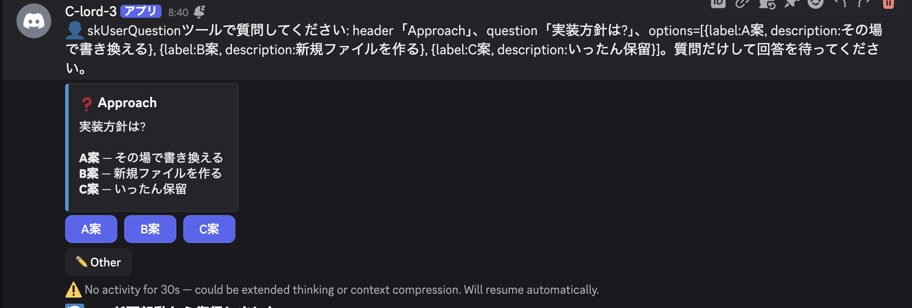

# AskUserQuestion → Discord Bridge

How c-lord turns Claude Code's **AskUserQuestion** TUI menu into clickable
Discord buttons in `CLORD_BRIDGE_MODE=jsonl` / tmux mode (production's mode).

Related issues: #166 (bridge), #169 (descriptions), #171 (keystroke timing),
#172 (free-text — open). See also [`tui-prompts.md`](./tui-prompts.md) §2-3.

## Why this exists

In jsonl/tmux mode Claude runs inside a tmux pane and `AskUserQuestion` renders
a **terminal menu** there; Claude then *blocks* waiting for a keyboard
selection. Nothing reached Discord, so a user watching Discord saw the session
stall with no way to answer. This bridge parses that menu, shows Discord
buttons, and delivers the choice back to the still-open menu as keystrokes.

> Note: the JSONL transcript carries the AskUserQuestion tool call, but the
> tmux runner does **not** populate `StreamEvent.ask_questions` — that field is
> only filled by the (currently unused) SDK-streaming runner. The live bridge
> works by **parsing the pane** (`_parse_ask_from_pane`), not the JSONL.

## Side-by-side

### What Claude Code shows in the tmux pane (raw)

```
 ☐ Approach

実装方針は?

❯ 1. A案
     その場で書き換える
  2. B案
     新規ファイルを作る
  3. C案
     いったん保留
  4. Type something.
────────────────────────────────────
  5. Chat about this

Enter to select · ↑/↓ to navigate · Esc to cancel
```

(The real capture also carries per-token ANSI colour codes that split `❯` from
`1.`; c-lord normalises them away before parsing — see #166.)

### What c-lord shows in Discord



```
❓ Approach
実装方針は?

A案 — その場で書き換える
B案 — 新規ファイルを作る
C案 — いったん保留

[A案] [B案] [C案]   [✏️ Other]
```

## Transformation rules

| Claude Code (tmux pane) | Discord | Handling |
|---|---|---|
| `☐ <header>` | embed title `❓ <header>` | header extracted |
| question line | embed body (first line) | question extracted |
| `❯ N. <label>` + indented description | **button `<label>`** + body legend `<label> — <description>` | label → button; description → legend (#169) |
| `Type something.` (meta) *or* the `Notes:` field | **`✏️ Other` button** (free-text modal) | mapped to free text; which of the two the menu has decides the keystrokes (#172, #650) |
| `Chat about this` (meta) | *(dropped)* | TUI-only affordance |
| `Enter to select · ↑/↓ · Esc` footer | *(dropped)* | replaced by clicking |
| ANSI colour codes | *(stripped)* | `_normalize_capture` before detection (#166) |
| keyboard select (↑/↓ + Enter) | **button click** | click → keystrokes sent to pane |

## Buttons vs. select menu

- **≤ 4 options, single-select** → buttons, **plus** a `label — description`
  legend in the embed body (Discord buttons cannot show descriptions) (#169).
- **≥ 5 options, or multi-select** → a Discord **select menu**, which shows
  each option's description in its dropdown; no body legend is added.
- **multi-select** additionally gets an explicit **`✅ 確定` (confirm) button**
  (#418): the select only *records* the choice, the button *submits* it. Without
  it the only way to submit was Discord's dismiss-the-dropdown gesture, which is
  undiscoverable — users reported "no way to confirm after picking". Single-select
  keeps immediate delivery (one pick = done, no confirm button).

## How a click is answered

(Single-select. For multi-select see the next section.)

The menu is still open in the pane and the cursor starts on the first option.
On a button click c-lord computes the chosen option's 0-based index and calls
`TmuxClaudeRunner.answer_menu(index)`, which sends:

```
Down  (×index)   then   Enter
```

**Keystrokes are sent one at a time with a short delay** (`_MENU_NAV_DELAY`,
0.25 s) between them. Batching them into a single `tmux send-keys Down Down
Enter` is too fast — the TUI drops the `Down` navigations and Enter selects the
wrong (first) option. This was a real regression (#171); the answer path is now
verified with the bot's actual `answer_menu` selecting the intended option.

While the bridge waits for the click, the runner is suspended at its `yield`,
so the pane is not re-polled and the menu is not re-detected (natural dedup).

## How a multi-select is answered (#418)

`answer_menu(index)` is single-select only — it sends `Down×index + Enter`, so a
multi-select click used to deliver only `selected[0]` and drop every other pick.
A multi-select question is now answered with `TmuxClaudeRunner.answer_menu_multi`,
which mirrors the native TUI's keyboard model (verified on a live Claude Code TUI):

```
for each chosen option (ascending):
    Down (×offset)   then   Space      # Space toggles the checkbox  [ ] ⇄ [✔]
Down (× to reach the "Submit" row at option_count + 1)   then   Enter   # → review screen
Enter                                  # confirm "Submit answers" (cursor defaults to it)
```

The `Submit` row sits one past the `Type something` meta-row (`option_count + 1`).
Reaching it + `Enter` opens the "Submit answers" review screen, whose cursor
defaults to submit, so a final `Enter` records **every** toggled value. Keys are
spaced by `_MENU_NAV_DELAY` (#171). Free text from `✏️ Other` in a multi-select
question still goes through the single free-text path below (Other yields one
typed string, not toggled options).

## How free text (`✏️ Other`) is answered (#172, #650)

**There are two menu layouts, and they take different keystrokes.** Claude Code
draws the classic list unless an option carries a `preview`, in which case the
options move into a narrow left column with the preview box beside them — and
that layout has **no `Type something.` row at all**. The free-text affordance is
read off the pane (`_free_text_mode`, carried on `AskQuestion.free_text_mode`),
never assumed, because sending the other layout's keys does not fail loudly: it
answers the tool with `(No answer provided)` and the typed sentence is gone.

### `row` — classic layout

The `Type something.` row is **not** confirmed with Enter. Verified on a live
Claude Code v2.1.150 TUI, pressing Enter on that row registers a *decline* and
no input field opens; and typing through `send_input` would post the text as a
*separate message* rather than the answer. The working sequence is to **type
onto the highlighted row**, which replaces its label, then confirm:

```
Down  (×index)            # navigate to "Type something." — NO Enter here
send_literal(text)        # type the text directly onto the row (no Enter)
Enter                     # records the typed text as the answer
```

`index` is the number of real options (the meta-row sits immediately after
them). Verified end-to-end: the typed text is recorded as `<question> → <text>`
(not "User declined to answer questions").

### `notes` — preview layout

```
 ☐ 配色案

どの配色にしますか？

❯ 1. 案A ダーク                   ┌──────────────────────────┐
  2. 案B ライト                   │ 案A ダーク               │
  3. 案C 高コントラスト           │ …preview…                │
                                  └──────────────────────────┘

                                  Notes: press n to add notes
──────────────────────────────────────────────────────────────
  Chat about this

Enter to select · ↑/↓ to navigate · n to add notes · Esc to cancel
```

There is no row to walk to. Verified on a live Claude Code v2.1.252 TUI in an
isolated tmux (2026-09-01):

```
n                         # opens the "Notes:" field (do NOT navigate first)
send_literal(text)        # type into the field
Enter                     # with no option selected, the notes ARE the answer
```

and the tool records
`"どの配色にしますか？"=(no option selected) notes: <text>`.

Walking `Down` × option_count here instead parks the cursor on **`Chat about
this`**, where every printable key is ignored and `Enter` returns
`(No answer provided)` — that is exactly how a user's typed answer was lost in
production on 2026-09-01 (#650).

### Shared

`TmuxClaudeRunner.answer_menu_text` implements both; `send_literal` (in
`tmux.py`) sends raw `send-keys -l` with no Enter and no jsonl ZWSP marker.
Keystrokes are spaced by `_MENU_NAV_DELAY` for the same timing reason as
`answer_menu` (#171). A menu that shows **neither** affordance gets
`allow_other=False`, so no `✏️ Other` button is offered at all — better than a
button whose keystrokes have nowhere to land.

## Multi-question Submit screen

A multi-question AskUserQuestion is handled one menu at a time as each renders in
the pane (each question → its own Discord buttons). After the last question is
answered, the TUI shows a **"Review your answers" / "Submit answers" / "Cancel"**
confirmation. That screen carries **no `Chat about this` marker**, so
`_parse_ask_from_pane` does not match it; without explicit handling it fell
through to the unknown-prompt path and surfaced a spurious *"Unknown TUI prompt
detected"* warning over an already-answered flow.

c-lord now recognises it (`_is_ask_submit_screen`) and **auto-submits**: the
cursor defaults to "Submit answers", so the poll loop presses a bare `Enter`
(after a short stability dwell, with signature dedup so a lingering screen isn't
Enter-ed twice) — mirroring the auto-accept used for trust/permission prompts.
The answers are already locked in via the bridge, so no further user input is
needed.

### The review screen has no input box under it (#611)

Prompt detection only scans the bottom of the pane (`_permission_zone`, 15 lines)
so that conversation text in the scrollback can't trigger an auto-accept (#156).
The review screen breaks the assumption that "the bottom of the pane" is where a
prompt sits: it draws **no input box beneath itself**, so a 40-row pane is left
with a tall run of blank rows under the options. The shorter the rendered block,
the taller that run — and with two questions it reached 23 rows, so a flat
`lines[-15:]` returned nothing but padding.

That window is shared, so the detector *and* its fail-safe went blind together:

| | expected | before #611 |
|---|---|---|
| `_is_ask_submit_screen` | True → press `Enter` | **False** → the answered flow never submits |
| `_has_unknown_interactive` | True → post "Unknown TUI prompt" to Discord | **False** → nothing is posted |

Neither one logs anything when it returns False, so the session stalled with **no
Discord message and no log line to grep for** — the user saw their answers vanish
(2026-08-31 11:28 JST; recovering by typing `1` was read as an interrupt).

`_permission_zone` now anchors the window to the last line that carries
**content** instead of the last line of the capture. Blank padding carries no
signal, so skipping it cannot widen the window into conversation text: a pane
that really does end in chrome (input box, status rows) keeps the exact #156
behaviour. Locked by `TestBlankTailPaneZone` in `tests/test_tmux_runner.py`,
which drives both functions over real captures
(`tests/fixtures/panes/ask_submit_screen_blank_tail.txt`,
`unknown_menu_blank_tail.txt`) at blank tails of 0/5/10/15/23/30 rows.

## Pre-menu prose (経緯・推し) (#399)

Claude usually *talks* right before opening a menu — explaining the options and
giving a recommendation. That prose lives in the same Claude turn-chunk as the
`AskUserQuestion` tool call, which the CLI **buffers in the JSONL until the menu
resolves**. Since text reaches Discord only via the transcript mirror, the
prose used to arrive only *after* the user answered (or never, when text and
tool_use merged into one event) — so the user was asked to choose with **no
decision context on Discord**.

c-lord now extracts that prose from the **pane** (`_extract_pane_context`): the
single `●` response block directly above the menu frame, and **nothing else** —
tool blocks (`● Bash(...)`/`⎿`), the echoed user prompt, and any unclassified
chrome line abort the extraction (fail-closed, to avoid reviving the #53
TUI-scrape leak class). It rides on `AskQuestion.context` and
`bridge_pane_ask` posts it as its **own silent message immediately before** the
menu embed (the embed is wiped on resolution, so the context must be a separate
message to stay readable).

**Long prose recovery via a transient tall capture (#468).** Claude Code runs as
a full-screen TUI whose *alternate screen keeps no scrollback*, so a normal
`capture_pane` only ever returns the visible rows. When the prose is taller than
the window (default 40 rows), its head scrolls off and `_extract_pane_context`
recovers nothing (`context_chars=0`) — the failure looked like "short prose works,
long prose doesn't". The JSONL can't help either: the prose is only flushed there
*after* the menu resolves. Since Claude redraws its whole conversation from memory
on `SIGWINCH`, c-lord now does a **transient tall re-capture** when the first
extraction yields empty context: it briefly grows the window
(`TmuxSessionManager.capture_pane_tall`), waits for the redraw to settle,
re-captures, restores the original window size exactly, and re-extracts. The
recovery only fires on empty context, so menus whose context already extracted are
untouched (no resize round-trip).

**De-duplication** (`bridged_context`): the CLI eventually flushes the same
prose to the JSONL, which the mirror would re-post. The two delivery paths
(pane-bridge, mirror) dedup against each other in an **order-independent** way —
each entry is tagged with its source and each side only matches the *other*
source:

- **AskUserQuestion**: prose is buffered until resolution, so the pane-bridge
  posts first and the later flush is suppressed by the mirror.
- **ExitPlanMode**: the CLI flushes the prose as a normal text event *before*
  the menu, so the mirror posts first and the pane-bridge then skips.

Either way the prose appears **exactly once**, before the menu.

## Concurrency & stuck-menu safety (#485)

A concurrent second session starting in the same tmux session used to desync the
menu state and fabricate an answer the user never gave. Three layers now prevent
it:

1. **The window→thread map is swapped atomically** (`tmux.py::_rebuild_mapping`
   builds a fresh dict and rebinds it once). The old `clear()`+repopulate left
   the shared map momentarily empty, so a concurrent capture/send saw the window
   as missing (`_find_window_for_thread` → `None`).
2. **An empty pane capture is treated as "unknown", not "menu gone"**
   (`tmux_runner.py::peek_menu_state` returns `(menu, capture_ok)`; the resolve
   watcher in `bridge_pane_ask` keeps waiting on an empty capture). Otherwise a
   momentary capture failure marked a still-open menu "✅ 端末で回答済み".
3. **A normal reply never selects an open menu** (`tmux.py::send_input` dismisses
   an open AskUserQuestion/plan menu with Esc *before* typing). Without this, a
   reply typed into a pane whose menu was still open had its trailing Enter
   select the highlighted default option — recording a choice the user never
   made. Last line of defense: even if a menu is somehow stuck open, a message
   cancels it and is delivered as text, never as a selection.

## One menu, one owner (#535)

Four independent paths can spot the same open TUI menu:

| Path | Trigger |
|---|---|
| `cogs/event_processor.py::_handle_pane_ask` | the live turn's poll loop yields `pane_ask` |
| `cogs/_run_helper.py` (post-turn recovery, #219/#222) | the menu rendered just after the turn finalized |
| `cogs/transcript_mirror.py::_make_ask_bridge` (#232) | the jsonl carries the `AskUserQuestion` tool call |
| `thread_state_sync.py::_maybe_bridge_open_menu` (#359) | sweep finds a menu no turn is watching |

They are all deliberate — each covers a case the others miss — so the question
is never "which one runs" but "which one **owns** the menu". Ownership is the
ask-bus registration, and `AskAnswerBus.register()` is the single atomic step
that grants it: the first caller gets the answer Queue, every later caller gets
`None` and returns before posting anything.

**What this replaced.** `register()` used to overwrite the existing waiter, and
only two of the four paths checked `is_active` first. So two bridges could both
pass the check and both post — the user saw the *same question twice* (one copy
mentioning them, one not), each copy live, with no way to tell which one
counted. Worse, the second registration silently discarded the first bridge's
Queue, so the bridge that was actually waiting could never be answered: it sat
out the full 24 h `ASK_ANSWER_TIMEOUT` holding its turn, and Claude — never
hearing back — eventually asked a *third* time.

A pre-check cannot fix this. `is_active()` and `register()` are two steps, and
both bridges can pass the check before either registers; the mirror widened that
window further by spawning its bridge as a background task between the two. So
`register()` itself refuses, and the `is_active` pre-checks that remain are only
cheap early exits, not the guarantee.

**What a losing bridge does: nothing, immediately.** It posts no buttons, no
duplicate pre-menu prose, sends no keystrokes, and — the part that used to wedge
threads — never enters the 24 h await. The owner answers the menu; the loser's
work was already done for it.

## After the click — what the thread shows (#536)

Pressing a button is the moment the user hands a decision to Claude, so the
thread has to say what happened to it. It used to say almost nothing:

| | before | now |
|---|---|---|
| delivered | the embed was wiped and replaced by a grey `-# ✅ Selected: X` | an interim `⏳ 送信中`, then an embed keeping **the question and the answer** once the answer is *confirmed* (#651) |
| not delivered | an **ephemeral** "⚠️ The bot was restarted…" — only the clicker saw it, gone on refresh | a normal message in the thread naming the **actual** cause |
| buttons on failure | **stayed live** | removed |
| other copies of the menu | stayed live | blanked out |
| multiSelect, chosen but not submitted | grey `-# 🔲 選択中: …` | full-size **まだ送信されていません** |

**Why the old failure notice was worse than nothing.** `post_answer` returning
False only means "no waiter is registered right now". The view treated that as
proof of a restart and said so — to a user who had, in most real cases, just
answered the same menu in the tmux pane. So the message was both invisible to
the thread and wrong, and the buttons stayed clickable, so the natural next move
was to click again and get the same nothing. yousan's report of the whole class:
「選んだあとに決定されていない気がして `y` とメッセージを送っていた」.

**Naming the cause instead of guessing it.** The bridge now records *why* a menu
stopped accepting answers as it closes — `AskAnswerBus.note_closed()` with one of
`answered` / `terminal` / `timeout` / `interrupted` — and the view reads it back.
Recorded knowledge always beats inference. Only when this process has no note at
all does the view fall back to inference, and then it uses the one fact that
actually implies a restart: a menu message **older than the process itself**
cannot have been posted by the process now handling its click.

**Other copies (`ask_menus`).** #535 makes a second copy impossible within one
process, but copies still outlive processes: a restart leaves the previous
process's message on screen with working-looking buttons. Every posted menu is
registered while answerable, and resolving one blanks the rest. A copy from a
*previous* process is out of reach of an in-memory registry by construction — it
is handled where it is reachable: its click lands on the honest "already closed"
path above, which disables it.

## What ✅ means — confirming the answer reached Claude (#651)

**c-lord used to never check that an answer arrived.** ✅ was printed the moment
`post_answer` returned True — before a keystroke had been sent, let alone
accepted. #536 and #600 added feedback around that decision, but both ask about
the *machinery* ("is a waiter registered", "did tmux take the keys"), not about
the answer. So on 2026-09-01 the keys went out perfectly, the menu closed, and
Claude recorded `(No answer provided)` — under a ✅ (#650).

Three questions, only the last of which is the one that matters:

| question | who answers it | what it proves |
|---|---|---|
| is a waiter registered? | `ask_bus.post_answer` | the click was not orphaned |
| did tmux take the keystrokes? | `TmuxSessionManager.send_keys` (#600) | the pane exists |
| **did Claude receive the answer?** | **Claude Code's transcript** | the actual thing |

So the click now leaves an interim **`⏳ 送信中`** state, and the bridge decides
the final state after the keystrokes, from the best evidence available:

1. **The transcript** (`transcript/ask_result.py`). Claude Code writes the
   menu's `tool_result`, and its wording is unambiguous — `The user answered: …`
   versus `(No answer provided)` / `The user wants to clarify these questions`.
   The menu's `tool_use` id is looked up **before** answering (afterwards a newer
   menu may already exist), and the pane's cwd gives the project dir
   (`TmuxClaudeRunner.transcript_project_dir`).
2. **The pane**, when there is no transcript to read: "the menu is gone". Weaker
   — it cannot tell a real answer from a discarded one — but far better than the
   pre-#651 answer of not looking at all.

| verified outcome | what the thread shows |
|---|---|
| answered | `✅` with the question and the answer (as before) |
| not answered | `⚠️` naming it: 「キーは送れましたが、Claude 側には『回答なし』として渡りました」 |
| not confirmed within the bound | `❔ 回答の結果を確認できませんでした` — neither claim is made |

**The bound is deliberate.** `_ANSWER_CONFIRM_TIMEOUT = 12s`, polled every
`_ANSWER_CONFIRM_POLL = 0.5s`. The ✅ waits on this, so it is latency the user
sees; measured on staging the `tool_result` lands about a second after the keys,
so 12s is slack for a busy host rather than an expected wait. Timing out is
reported as ❔, never as ✅: silence is not evidence of success — and it is not
evidence of failure either, so it is not reported as ⚠️.

## Answering by typing (#536 AC7)

Buttons used to be the only way to answer. Typing — which is what people do when
the buttons feel unresponsive — took the **interrupt** path: the open question
was discarded without a word (`⚡ Interrupted. Starting with new instruction...`)
and the sentence ran as a fresh instruction. So an attempt to answer looked, from
the user's side, like nothing happening at all. yousan hit exactly this: 「選んだ
あとに決定されていない気がして `y` とメッセージを送っていた」.

**A sentence sent while a menu is open is now delivered as that menu's answer**
(`claude_chat.py::_maybe_answer_open_menu`), through the same free-text path as
the ✏️ Other modal. The menu's copies are blanked to `✏️ 文章で回答しました: …`,
and the thread gets a **「これは新しい指示でした」** button
(`views.py::TextAnsweredMenuView`) that re-dispatches the message as an
instruction — the old behaviour, one click away.

Guessing "answer" is the right default because the two mistakes are not
symmetric: a mis-read instruction costs one button, while a dropped answer costs
the whole exchange (and, before #535, the user had usually already tried the
buttons).

Three cases stay instructions, because as answers they are nonsense:

| case | why |
|---|---|
| empty body | nothing to deliver |
| message with attachments | a file is not a menu choice |
| menu with no free-text affordance | plan-approval menus (`allow_other=False`) have no `Type something.` row (#251), and a menu whose pane shows neither that row nor a `Notes:` field is read the same way (#650); typing there would mis-send keystrokes |

The bridge is what knows which menus take free text, so it declares it when it
claims the menu: `ask_bus.register(thread_id, allow_free_text=question.allow_other)`.
The flag defaults to False, so a caller that has not thought about it cannot opt
a menu in by accident. For a pane-parsed menu `allow_other` is derived from the
pane (`free_text_mode != "none"`), so the button and the keystrokes can never
disagree about whether this menu takes typed text.

## The prose is only readable from the pane (#549)

Measured on staging (CLI 2.1.246, 2026-08-26): **while a menu is open, nothing
of that turn exists in the jsonl.** Not the prose, not the `AskUserQuestion`
`tool_use` — for 90 seconds of polling the file ended at the user's own message,
and the whole chunk landed at once the moment the menu was answered (the prose
carried a 04:01:46 timestamp but only became readable at ~04:05).

So "read the transcript ahead of the menu and post the 経緯 first" is not an
option: there is nothing to read. **While a menu is open, the pane is the only
source of the prose**, which is why the pane path exists at all (#399) and why
its ceiling matters so much (#468).

**The watchdog had no ceiling at all.** `_maybe_bridge_open_menu` captured 120
lines and parsed; when the prose was taller than the window it simply got
`context=""`. The poll loop had recovered that since #468 by transiently growing
the window — the watchdog never did. A menu bridged by the watchdog after a long
report therefore reached Discord with no context, and the report showed up only
after the answer, reading as a new statement. That is the whole of #549's
"順序が入れ替わる" report. The watchdog now does the same tall re-capture, on the
same condition (only when the first read came up empty, so an ordinary menu
never pays the resize round-trip).

**When even that comes up empty**, the menu says so in its footer —
`この質問の経緯は、回答後にまとめて届きます`. The gap cannot be closed (see the
measurement), so the next best thing is to stop it from reading as an omission.

## An option the pane cannot be read from (#579)

Discord rejects a button with an empty label — and rejects the **whole message**
with it. So a single option c-lord failed to read silenced the entire menu, and
because a menu that never posted still looks unbridged, the watchdog retried it
every sweep: **128 failed posts in one day** on one thread, each swallowed as
asyncio's `Task exception was never retrieved`.

The pane that caused it (captured live, now
`tests/fixtures/panes/ask_wrapped_option_empty_label.txt`) drew the menu as a
two-column table, and one option's text did not fit beside the preview box:

```
❯ 1. 具体的な場面から入る（推     ┌──────────────
    奨）                          │ …
  2.                              │
    欠けているものを先に並べる    │ …
  3. チーム共有を主役にする       │ …
```

Three parser rules come out of that pane:

- **A wrapped tail belongs to the label above.** In a preview-table menu
  (`pane_col` is set) the explanation lives in the box on the right, so a
  non-numbered line in the narrow left column can only be the continuation of
  the option above it. *Indentation cannot decide this*: descriptions sit at
  column 5 in a plain menu but at column 2 in a multiSelect one (the `[ ] `
  checkbox shifts them), which overlaps the wrapped-tail indent — the first
  attempt at an indent rule swallowed multiSelect descriptions into labels.
- **Strip the preview box per line, not by column.** `pane_col` is a *character*
  index taken from the numbered lines, but the box is drawn at a fixed *display*
  column; a line of double-width text reaches it in fewer characters, so the
  slice alone leaves `│` (and the preview text) inside the label.
- **The `Chat about this` row is not the last option's description.** The
  description scan ended at `end_idx + 1`, which is that row.

**Two backstops sit behind the parser**, because the next unseen rendering will
break it again:

- `ask_view.py::_button_label` substitutes the TUI's own number for an empty
  label. It *substitutes* rather than dropping the option: answers are delivered
  as `Down × index`, so a shorter list would select the wrong choice.
- The watchdog stops after `_ASK_BRIDGE_MAX_FAILURES` (3) consecutive failures
  for a thread, logs each one, and tells the thread it could not show the
  choices (with the `tmux attach` target). Without a cap the pair is a closed
  loop — the post fails, so the menu stays unbridged, so the sweep fires again.
## A menu only counts while claude is alive (#510)

Pane text outlives the process that drew it. When claude exits — a crash, a
`/exit`, or a machine reboot — its last screen stays on display, and
tmux-resurrect will even restore that screen verbatim into a fresh shell
(`cat <pane_dump>; exec zsh`) the next time the tmux server starts. Such a pane
parses as a perfectly valid open AskUserQuestion.

So **every menu peek asks the process table before trusting the text**:

- `tmux.py::TmuxSessionManager.pane_foreground_command` reads
  `#{pane_current_command}`, returning `None` when it cannot be read.
- `tmux.py::pane_command_is_dead` turns that into a decision: dead **only** when
  a command was positively read and it is not claude. Unreadable is *unknown*,
  never dead — the same asymmetry as the empty-capture rule above, so a tmux
  hiccup can never silence a real question.
- The watchdog (`thread_state_sync.py::_maybe_bridge_open_menu`) skips dead
  panes, and the resolve-watcher's peeks (`tmux_runner.py::peek_menu_state` /
  `peek_pending_ask`) report "no menu" for them, so a bridge that is already
  waiting winds down within seconds.

Without this, a corpse pane was re-bridged forever: the bridge pinged the owner,
waited out the 24 h `ASK_ANSWER_TIMEOUT`, sent its cancelling Esc into a shell
(a no-op, so the "menu" never went away), and the watchdog bridged the same dead
question again — one `@mention` per day for a question answered weeks earlier.

## The same menu is posted once (#633)

The sweep sees an open menu again on every 60-second tick, so "have I already
posted this?" has to be answered somewhere. #600 answered it with an in-memory
counter — and **the counter died with the process.** Production restarts the bot
several times a day, so each new process started every stranded menu over at
`attempt=1/3`:

```
Aug 31 17:28:03  Started menu watchdog loop (interval=60s)
Aug 31 17:28:08  menu watchdog: bridging unwatched TUI menu (… header='改名先' attempt=1/3)
Aug 31 17:49:46  Started menu watchdog loop (interval=60s)
Aug 31 17:49:51  menu watchdog: bridging unwatched TUI menu (… header='改名先' attempt=1/3)
Aug 31 18:02:57  Started menu watchdog loop (interval=60s)
Aug 31 18:03:03  menu watchdog: bridging unwatched TUI menu (… header='改名先' attempt=1/3)
```

188 re-bridges in one thread; the same `❓ 切り口` embed reached Discord six times
over three days. The second reset was `MenuRebridgeLedger.clear()` on a
*successful* bridge: `bridge_pane_ask` returns as soon as it stops waiting —
including when the answer went out but never took effect — so a menu whose
answer could not reach the TUI got a fresh budget every time.

The rule now:

- **Identity** — `thread_state_sync.py::menu_fingerprint` hashes the menu's
  header, its question line and its option labels in order. Descriptions and the
  pre-menu 経緯 are excluded: they are re-wrapped by every redraw and by every
  window resize, so including them would make one stranded menu look like a new
  question on each tick.
- **Budget** — one post per `(thread, fingerprint)`, held in the `menu_bridges`
  SQLite table (`c_lord/database/menu_bridge_repo.py`), so a restart cannot
  forget it.
- **Release** — only a sweep that sees the thread's pane with **no menu on it**
  clears the thread's rows. Observation ends the episode, never a bridge
  completing. A genuinely new question — even one worded identically — is posted
  again, because the pane went menu-free in between. An **empty** capture is
  "could not read", not "no menu" (#485), so it releases nothing.
- **A failed post keeps its budget** — the row is rolled back when
  `bridge_pane_ask` raises, so #579's retry of a menu Discord rejected still
  works. The budget is spent by a menu the user can *see*, never by an attempt
  that never reached the thread; `_ASK_BRIDGE_MAX_FAILURES` still bounds those
  retries at 3.

## The 経緯 stops at a tool block (#633)

`_extract_pane_context` walks up from the menu to the `●` block above it. A
finished tool block folds, on every redraw, into a single **indented** summary
line — `Ran 2 shell commands`, `Searched for 3 patterns, read 1 file, ran 6
shell commands` — which looks exactly like a prose continuation, so the walk
stepped straight over it and attached the block from *before* the tool call:

```
● ロールバック方針は、…                 ← already delivered by the mirror
  …
  Ran 1 shell command                   ← folded tool block (indented!)
──────────────────────────────
 ☐ ロールバック                          ← the menu being bridged
```

That block is not the menu's 経緯. The CLI only buffers the jsonl chunk that
carries the menu, so anything separated from the menu by a completed tool block
has **already** been posted by the transcript mirror. Carrying it re-posted a
two-day-old answer as new: in thread `1508626302813601843` the same 1900-char
message was delivered on 2026-08-26 (`1542012051361239073`) and again on
2026-08-28 (`1542810482526658591`).

`_FOLDED_TOOL_SUMMARY_RE` therefore ends the walk. It matches on *shape*, not
vocabulary — a comma-joined list of `<verb> [for] <N> <noun…>` clauses and
nothing else — so ordinary prose that happens to start with an English verb is
untouched, and an unknown wording only costs a fail-closed `context=""` (the
mirror still delivers it, late). The pane above is
`tests/fixtures/panes/i633_stale_prose_above_folded_tool.txt`, captured live
from Claude Code v2.1.252.

## Limitations

- **Free text on the Submit screen is not re-editable from Discord.** The review
  screen is auto-submitted as-is; to change an answer, use `/attach`.
- **Pre-menu prose extraction is best-effort and fail-closed** (#399, #633): if
  the block above the menu isn't a clean `●` prose block (tool output, chrome,
  or anything on the far side of a folded tool summary), no context is carried
  rather than risk leaking chrome or re-posting text the mirror already sent.
  The mirror still delivers it (late) in that case.
- **Prose taller than the transient capture height is still truncated** (#468):
  the tall re-capture recovers prose up to `capture_pane_tall`'s height
  (240 rows). Prose longer than that still loses its head and falls back to the
  late mirror flush — the same degraded mode as before, just with a much higher
  ceiling.

## Source map

| Concern | Location |
|---|---|
| Parse menu from pane | `c_lord/claude/tmux_runner.py::_parse_ask_from_pane` |
| Extract pre-menu prose (#399) | `tmux_runner.py::_extract_pane_context` |
| Recover long prose via transient tall capture (#468) | `c_lord/tmux.py::TmuxSessionManager.capture_pane_tall`, wired in `tmux_runner.py::run` (poll loop) |
| Same recovery for the watchdog path (#549) | `thread_state_sync.py::_maybe_bridge_open_menu` |
| Detect & yield `pane_ask` event | `tmux_runner.py::run` (poll loop) |
| Ignore menus in a pane whose claude has exited (#510) | `c_lord/tmux.py::pane_command_is_dead`, `TmuxSessionManager.pane_foreground_command`, `thread_state_sync.py::_maybe_bridge_open_menu`, `tmux_runner.py::peek_menu_state` |
| Show buttons / route answer / post context | `c_lord/discord_ui/ask_handler.py::bridge_pane_ask` |
| One-owner-per-thread menu arbitration (#535) | `c_lord/discord_ui/ask_bus.py::AskAnswerBus.register` |
| Why a menu closed / what a late click is told (#536) | `ask_bus.py::note_closed`, `ask_view.py::_undeliverable_reason` |
| Answered / undelivered embeds (#536) | `embeds.py::ask_answered_embed`, `ask_undelivered_embed` |
| Confirming the answer reached Claude (#651) | `c_lord/transcript/ask_result.py`, `ask_handler.py::_verify_answer_reached_claude` / `_finalize_menu_message`, `tmux_runner.py::transcript_project_dir`, `tmux.py::pane_working_dir` |
| Interim / unconfirmed embeds (#651) | `embeds.py::ask_sending_embed`, `ask_unconfirmed_embed` |
| Disabling other live copies (#536) | `c_lord/discord_ui/ask_menus.py` |
| 文章での回答 / 誤爆の取り消し (#536 AC7) | `cogs/claude_chat.py::_maybe_answer_open_menu`, `views.py::TextAnsweredMenuView` |
| Order-independent context dedup (#399) | `c_lord/discord_ui/bridged_context.py` |
| Suppress flushed-twin context | `c_lord/transcript/mirror.py` (assistant_text branch) |
| Buttons & legend | `c_lord/discord_ui/ask_view.py`, `embeds.py::ask_embed` |
| Empty-label backstop / watchdog retry cap (#579) | `ask_view.py::_button_label`, `thread_state_sync.py::_ASK_BRIDGE_MAX_FAILURES` |
| One post per menu, across restarts (#633) | `thread_state_sync.py::menu_fingerprint` / `MenuRebridgeLedger`, `c_lord/database/menu_bridge_repo.py::MenuBridgeRepository`, `menu_bridges` table |
| 経緯 stops at a folded tool block (#633) | `tmux_runner.py::_FOLDED_TOOL_SUMMARY_RE`, fixture `tests/fixtures/panes/i633_stale_prose_above_folded_tool.txt` |
| Send selection keystrokes | `tmux_runner.py::answer_menu` / `answer_menu_multi` (#418) / `answer_menu_text` |
| Multi-select confirm button | `ask_view.py::AskView` (`_multi_select_record` + `_confirm_callback`, #418) |
| Regression fixtures | `tests/fixtures/panes/ask_user_question_*.txt` |
