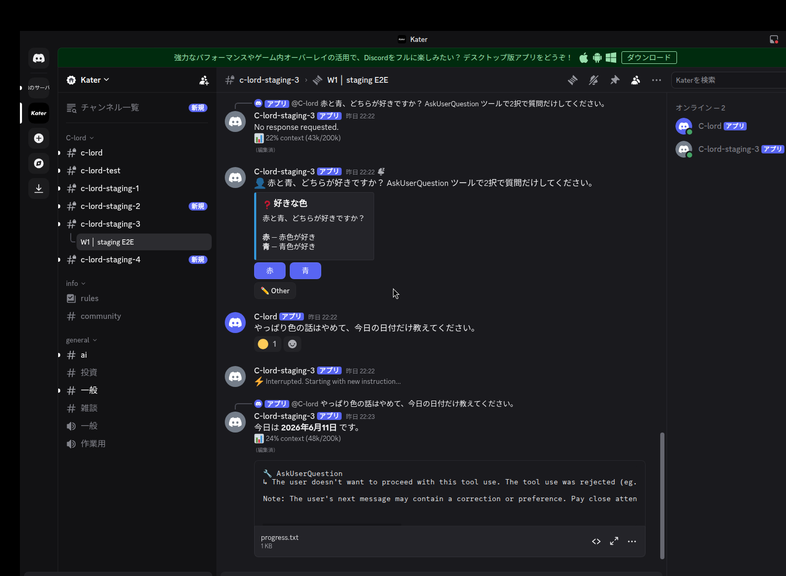

# #315 — 対話メニュー未応答でスレッドが恒久デッドロックする問題 / staging 実機証跡

PR #317。staging フリート #3（`C-lord-staging-3`, E2E スレッド `1514546023282769920`）で
trusted-bot トリガーにより RED→GREEN を実機確認した。

## GREEN（branch=fix/thread-lock-deadlock-315）

実 Discord クライアントの画面。時系列:
1. 誘発プロンプト → `好きな色` の **AskUserQuestion ボタン**が出る（メニューが bridge され park）
2. ボタンを**押さず**に2通目「やっぱり色の話はやめて、今日の日付だけ教えてください。」を送信
3. **`⚡ Interrupted. Starting with new instruction...`**（新メッセージが進行中ターンを割り込み）
4. **「今日は 2026年6月11日 です。」** — 2通目に Claude が回答

## RED（branch=main, バグあり）

同じ手順（メニュー bridge → ボタン未応答 → 2通目）で、**2通目は無言ドロップ**:
`run_claude: enter` がインクリメントされず（処理されない）、`⚡` も応答も出ない＝スレッドが
恒久 wedge。出力だけ届くのは TranscriptMirror が JSONL を独立 tail しているため。

（RED は「何も起きない」ため画面では空。ログ証跡と unit RED→GREEN
`tests/test_claude_chat.py::test_parked_menu_run_does_not_wedge_thread` を参照。）
