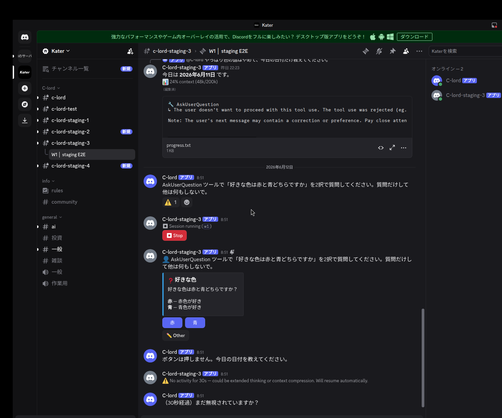
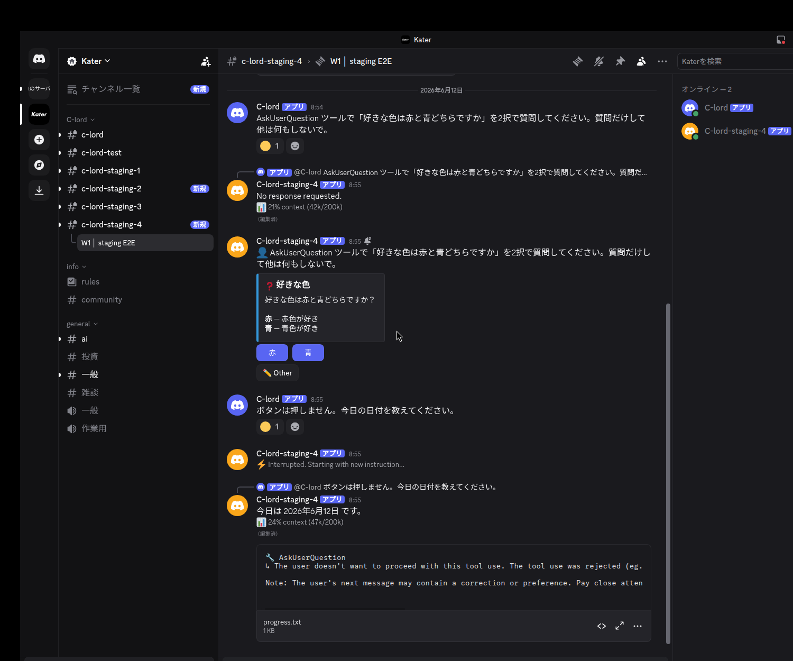

# #315 — 対話メニュー未応答でスレッドが恒久デッドロックする問題 / staging 実機証跡

PR #317。問題発生条件と修正後を、**同じ入力**で staging フリート実機 RED→GREEN 比較。

**問題発生条件**: スレッドで Claude が **AskUserQuestion / Plan承認メニュー**を出し（= Discord にボタンが
bridge され、クリック待ちで *park* する）、ユーザーがそのボタンを押さずに別のメッセージを送ると、これまで
その後続メッセージが Claude に届かず（無言ドロップ）スレッドが恒久 wedge していた。

両スクショとも、**同じ AskUserQuestion メニュー**（`好きな色は赤と青どちらですか` の 赤/青 ボタン）が
出ている＝ park 状態を作った上で、**同じ後続メッセージ**「ボタンは押しません。今日の日付を教えてください。」
を送っている。RED と GREEN の違いは挙動だけ。

## RED（branch = `main` / バグあり） — メニューが出ていて、それが原因で後続が無視される

- `好きな色` の AskUserQuestion ボタン（メニュー bridge・park）が出ている
- ボタンを押さず後続を送信:「ボタンは押しません。今日の日付を教えてください。」→ さらに「（30秒経過）まだ無視されていますか？」
- **どちらにも応答が返らない**（`run_claude: enter` が増えない＝処理されていない）。メニューが park したまま
  スレッドが wedge し、後続入力が tmux に届いていない。

## GREEN（branch = `fix/thread-lock-deadlock-315`） — 同じメニュー park でも後続が処理される

- 同じ `好きな色` の AskUserQuestion ボタン（park）
- 同じ後続「ボタンは押しません。今日の日付を教えてください。」→ **`⚡ Interrupted. Starting with new instruction...`**
  → **「今日は 2026年6月12日 です。」**（後続にちゃんと回答）

## AskUserQuestion と Plan承認メニューは同一経路（この証跡は両方をカバー）

両メニューは tmux ペインの検出だけ別で、その後は**同じ `pane_ask` イベント → 同じ `bridge_pane_ask`** を
通り、**同じく run を park** させる（`c_lord/claude/tmux_runner.py`: `_parse_ask_from_pane` /
`_parse_plan_from_pane` がともに `pane_ask` を yield → ログは両方 `Interactive menu detected, bridging
to Discord`）。デッドロックも修正（`_run_helper` の post-turn 再bridge を `runner.stopped` でスキップ ＋
ロックを run 全体で握らない）も**メニュー種別に依存しない**ので、上の AskUserQuestion 証跡が Plan承認
メニューのケースも代表している。Plan承認メニューでの実機スクショも必要なら別途撮影可。

## 補助証跡

- unit RED→GREEN: `tests/test_claude_chat.py::test_parked_menu_run_does_not_wedge_thread`（main で DEADLOCK / 修正後 pass）
- post-turn 再bridgeガード: `tests/test_run_helper.py::test_stopped_run_does_not_rebridge_post_turn`
